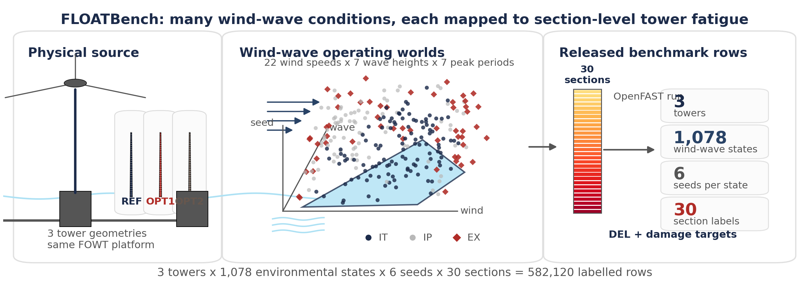
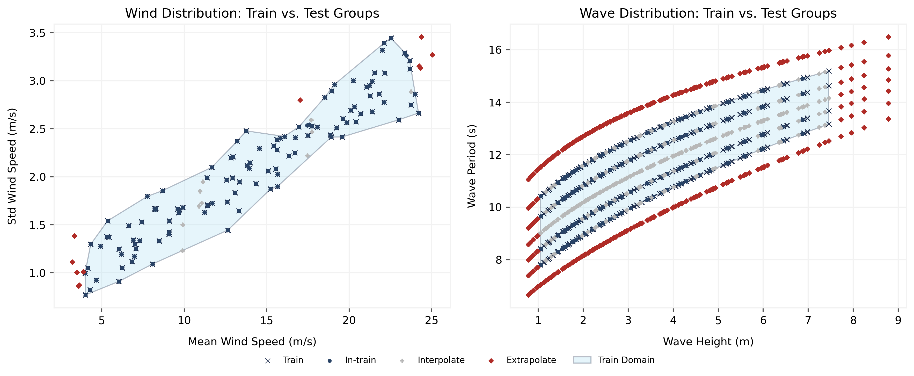
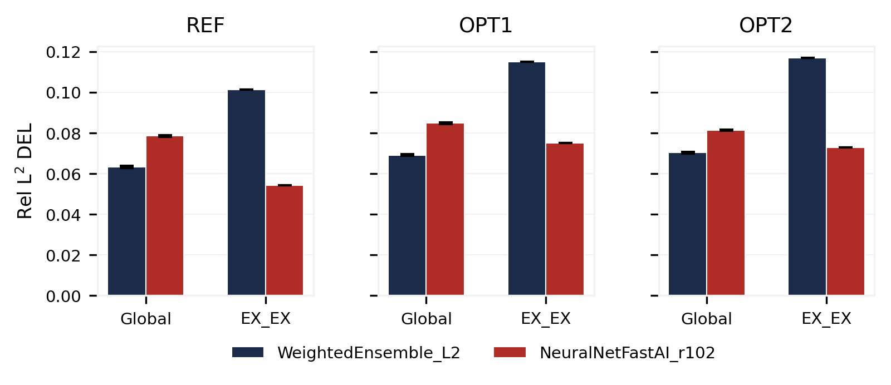

# FLOATBench

Benchmark code for **FLOATBench: Wind Turbine Tower Damage**, a tabular
fatigue benchmark for 22 MW floating offshore wind turbine (FOWT) towers.
The dataset is hosted separately on Hugging Face:
[`DeCoDELab/FLOATBench`](https://huggingface.co/datasets/DeCoDELab/FLOATBench).



## What's in this repo

```
floatbench/        Python package (training, evaluation, plots, splitter)
scripts/           Entry points for each pipeline stage
  ├── train/       AutoGluon training (best / extreme presets)
  ├── test/        Predict + per-section + per-regime evaluation
  ├── leaderboard/ Bootstrap CI tables (DEL only)
  ├── benchmark/   Cross-preset merge (heatmaps, bump, family, model_pool)
  └── run_benchmark.py    one-shot orchestrator (E2 + E3)
examples/          Reproducible scripts for the paper figures
requirements.txt   Pinned runtime dependencies (Python 3.11)
```

## Install

```bash
git clone https://github.com/DeCoDELab/floatbench
cd floatbench
pip install -r requirements.txt
```

## Get the data

The released CSVs sit on Hugging Face. Either download them under
`data/` or load them directly from Python:

```bash
# Option A: download with the HF CLI (one-time)
huggingface-cli download DeCoDELab/FLOATBench --repo-type=dataset --local-dir=data

# Option B: load on-the-fly from Python
python -c "from datasets import load_dataset; \
  ds = load_dataset('DeCoDELab/FLOATBench', 'ref'); print(ds)"
```

After this you should have `data/{ref,opt1,opt2}/{train_damage.csv,
test_damage.csv,data.csv,metadata.json}`.

## Quickstart

```bash
# Smoke test (~10 min total: 2 min per train, 2 trains, leaderboard, benchmark)
python scripts/run_benchmark.py --experiment=within --tower=ref \
    --time_limit=120

# Full reproduction of the paper, all 6 experiments (E2 + E3, ~48 GPU-hours)
python scripts/run_benchmark.py --experiment=all
```

Outputs land in `outputs/within/{ref,opt1,opt2}/` and
`outputs/cross/{ref,opt1,opt2}/`, each containing trained models,
leaderboards with bootstrap CIs, and a cross-preset benchmark folder.

### Stages individually

```bash
# Train one preset
python scripts/train/run.py --flagfile=scripts/train/config.cfg \
    --train_csv=data/ref/train_damage.csv \
    --test_csv=data/ref/test_damage.csv \
    --output_dir=outputs/ref/best

# Evaluate
python scripts/test/run.py --flagfile=scripts/test/config.cfg

# Bootstrap leaderboard (DEL only)
python scripts/leaderboard/run.py --flagfile=scripts/leaderboard/config.cfg

# Cross-preset benchmark (heatmaps, bump charts, model_pool table)
python scripts/benchmark/run.py --flagfile=scripts/benchmark/config.cfg
```

## Reproducing the regime-aware split

The benchmark stratifies test points by their distance to the training
envelope (alpha-shape over the joint wind/wave grid), populating all
nine cells of the in-train / interpolate / extrapolate × wind/wave grid:



The release ships pre-split CSVs, but the alpha-shape regime-aware
partition can be re-derived from `data.csv`:

```python
import pandas as pd
from floatbench.split import split_train_test, split_test_groups

data = pd.read_csv("data/ref/data.csv")
df_train, df_test = split_train_test(
    data, combinations_wind=-1, combinations_waves=4, combinations_seed=6,
)
test_with_regimes = split_test_groups(
    df_train, df_test,
    interp_names=["In-train", "Interpolate"], interp_edges=[0.5],
    extrap_names=["Extrapolate"],
)
```

The output matches the released `wind_group` and `wave_group` columns
exactly (verified end-to-end on the `ref` tower).

## Headline finding: the global rank-1 fails at the boundary

On every tower, the AutoGluon default ensemble (`WeightedEnsemble_L2`)
ranks first globally yet is overtaken at the worst-case wind-and-wave
extrapolation cell (EX_EX) by a neural-network family the greedy
selector systematically excludes:



## Reproducing paper figures

```bash
python examples/figure_geom_damage.py
```

## License

Code released under the [MIT License](LICENSE.txt). Dataset on
Hugging Face is released under
[CC-BY-4.0](https://creativecommons.org/licenses/by/4.0/).

## Authors

João Alves Ribeiro (corresponding, `jpar@mit.edu`), Bruno Alves Ribeiro,
Francisco Pimenta, Sérgio M. O. Tavares, Faez Ahmed.

## Citation

```
@inproceedings{floatbench2026,
  title  = {FLOATBench: A Dataset and Benchmark for Floating Offshore
            Wind Turbine Tower Fatigue},
  author = {Alves Ribeiro, Jo\~ao and Alves Ribeiro, Bruno and
            Pimenta, Francisco and Tavares, S\'ergio M.\,O. and
            Ahmed, Faez},
  booktitle = {NeurIPS 2026 Datasets and Benchmarks Track},
  year   = {2026}
}
```
