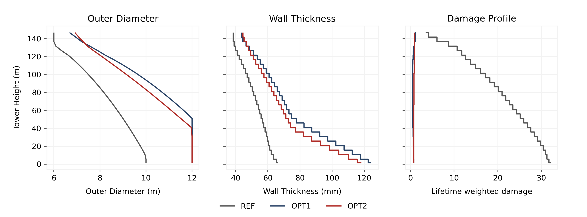
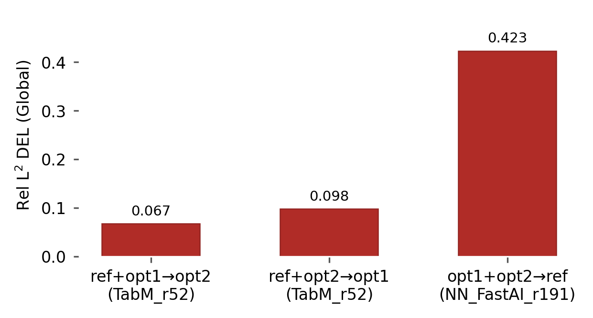

<p align="center">
  
</p>

# FLOATBench: A Dataset and Benchmark for Floating Offshore Wind Turbine Tower Fatigue

Benchmark code for the FLOATBench tabular fatigue benchmark on three 22 MW
floating offshore wind turbine (FOWT) towers. The dataset is hosted
separately on Hugging Face:
[`DeCoDELab/FLOATBench`](https://huggingface.co/datasets/DeCoDELab/FLOATBench).


## What's in this repo

```
floatbench/        Python package (training, evaluation, plots, splitter)
scripts/           Entry points for each pipeline stage
  ├── train/       AutoGluon training (best / extreme presets)
  ├── test/        Predict + per-section + per-regime evaluation
  ├── leaderboard/ Bootstrap CI tables (DEL only)
  ├── benchmark/   Cross-preset merge (heatmaps, bump, family, model_pool)
  └── run_benchmark.py    one-shot orchestrator (E2 + E3)
examples/          Reproducible scripts for the paper figures
requirements.txt   Pinned runtime dependencies (Python 3.11)
```

## Install

**Recommended (conda, GPU):**

```bash
git clone https://github.com/Joao97ribeiro/FLOATBench
cd FLOATBench
conda env create -f environment.yml
conda activate floatbench
```

This installs Python 3.12, PyTorch 2.6+ with CUDA 12.4, and all
AutoGluon backends (LightGBM, CatBoost, XGBoost, FastAI, TabM,
TabPFN, Mitra) plus the splitter / plot helpers from
`requirements.txt`.

**Alternative (pip, CPU or existing venv):**

```bash
git clone https://github.com/Joao97ribeiro/FLOATBench
cd FLOATBench
pip install torch  # any torch>=2.6,<2.10
pip install -r requirements.txt
```

## Dataset

FLOATBench captures fatigue damage along the towers of three 22 MW
floating offshore wind turbines (FOWTs). Each tower is the IEA-22-MW
reference platform with a redesigned tower:

- `ref` — IEA-22-MW reference tower (baseline)
- `opt1` — first redesign iterate (relaxed damage budget, $D \le 1.0$)
- `opt2` — final iterate ($D \approx 0.9$, targeting $D \le 0.9$)

For every tower we run 1,078 OpenFAST aero-servo-elastic simulations
(1,440 s each, with 6 turbulence seeds per setpoint), then post-process
damage-equivalent loads (DEL) and Palmgren–Miner damage at each of 30
tower sections. The result is a tabular dataset where every row is one
section under one operating condition.



### At a glance

| | per tower | total (3 towers) |
| --- | ---: | ---: |
| Simulations (cases) | 1,078 | 3,234 |
| Sections | 30 | 30 |
| Rows | 194,040 | 582,120 |
| Train rows (regime-aware split) | 51,840 (26.7%) | 155,520 |
| Test rows | 142,200 (73.3%) | 426,600 |
| Wind speeds | 21 setpoints, 4–25 m/s | — |
| Sea states ($H_s$, $T_p$) | 56 unique pairs | — |
| Turbulence seeds | 6 per setpoint | — |
| OpenFAST run length | 1,440 s | — |

### Files per tower (`data/{ref,opt1,opt2}/`)

| File | Rows | Purpose |
| --- | ---: | --- |
| `train_damage.csv` | 51,840 | training fold (regime-aware split) |
| `test_damage.csv` | 142,200 | test fold with `wind_group` / `wave_group` regime labels |
| `data.csv` | 194,040 | full table (train + test) with `is_train` flag |
| `metadata.json` | — | counts, split mode, schema version |

### Schema (key columns)

| Column | Unit | Description |
| --- | --- | --- |
| `sim_id` | — | unique simulation case id |
| `wind_speed` | m/s | nominal hub-height wind speed |
| `mean_wind_speed` | m/s | realized mean wind over the 1,440 s window |
| `std_wind_speed` | m/s | realized turbulence intensity |
| `wave_hs` | m | significant wave height |
| `wave_tp` | s | spectral peak period |
| `wind_seed_id` | — | turbulence seed (1–6) |
| `section_id` | — | tower section (1–30, base to top) |
| `section_height_m`, `section_radius_m`, `section_thickness_m` | m | section geometry |
| `damage` | — | Palmgren–Miner damage at the section |
| `damage_weight` | — | weight to recover lifetime damage via $\sum w_i D_i$ |
| `wind_group`, `wave_group` | — | regime label: `In-train`, `Interpolate`, `Extrapolate` (test only) |

### Wind / wave regimes

The test fold partitions across an alpha-shape envelope of the training
operating-condition cloud, populating all nine cells of the
`In-train × Interpolate × Extrapolate` (wind × wave) grid:


### Download

```bash
# Option A: download with the HF CLI (one-time)
hf download DeCoDELab/FLOATBench --repo-type=dataset --local-dir=data

# Option B: load on-the-fly from Python
python -c "from datasets import load_dataset; \
  ds = load_dataset('DeCoDELab/FLOATBench', 'ref'); print(ds)"
```

After this you should have `data/{ref,opt1,opt2}/{train_damage.csv,
test_damage.csv, data.csv, metadata.json}`.

## Quickstart

```bash
# Smoke test (~10 min total: 2 min per train, 2 trains, leaderboard, benchmark)
python scripts/run_benchmark.py --experiment=within --tower=ref \
    --time_limit=120

# Full reproduction of the paper, all 6 experiments (E2 + E3, ~48 GPU-hours)
python scripts/run_benchmark.py --experiment=all

# Custom training budget (e.g. 8 h per training instead of the 4 h default)
python scripts/run_benchmark.py --experiment=all --time_limit=28800
```

`--time_limit` controls the AutoGluon training budget (in seconds) per
preset and per experiment. Default is `14400` (4 h, paper setting). Use a
small value (e.g. `120`) for a quick smoke test, or a larger value to
push beyond the paper budget. Outputs land in
`outputs/within/{ref,opt1,opt2}/` and `outputs/cross/{ref,opt1,opt2}/`,
each containing trained models, leaderboards with bootstrap CIs, and a
cross-preset benchmark folder.

### Hardware & runtime

The benchmarks were run on a single workstation; nothing in the
pipeline assumes a cluster. The defaults in `scripts/train/config.cfg`
expose every knob:

| Resource | Paper setting | Notes |
| --- | --- | --- |
| GPU | 1 × NVIDIA (24 GB used; 16 GB is enough) | Used for AutoGluon NN tabular families and TabPFN. Tunable via `--num_gpus` / `--num_gpus_per_fold`. |
| CPU | 24 cores total, 12 per bagging fold | Tunable via `--num_cpus` / `--num_cpus_per_fold`. |
| RAM | ≈ 32 GB | Peaks during AutoGluon ensembling. |
| Disk | ~225 MB dataset + ~5–10 GB trained models | One AutoGluon predictor per preset/tower/experiment. |
| Wall-clock | 4 h per preset (paper budget) | Set by `--time_limit`; full reproduction (3 towers × 2 presets × {within, cross}) ≈ 48 h. |

CPU-only training works for `--presets=best` (tree ensembles only) but
is significantly slower for `--presets=extreme` and effectively
disables `zeroshot_2025_tabfm` (TabPFN).

### What lands in `outputs/<exp>/<tower>/`

After a full run the experiment root is laid out like this:

```
outputs/within/ref/
├── best/model/                    AutoGluon predictor (best preset)
│   ├── autogluon_meta.json        config + features used at fit time
│   ├── leaderboard.csv            AG built-in leaderboard (val score)
│   ├── leaderboard_test.csv       same leaderboard, scored on test set
│   ├── leaderboard_test_summaries/
│   │   ├── leaderboard_test_metrics.csv      r2 / RelL² damage + DEL
│   │   ├── leaderboard_test_groups.csv       per-regime metrics (IT/IP/EX × wind/wave)
│   │   ├── leaderboard_test_sections.csv     per-section metrics (1 row per model × section)
│   │   └── del/                              bootstrap CI95 over DEL (paper Table 2)
│   │       ├── leaderboard_test_summary.csv          point estimates
│   │       ├── leaderboard_test_summary_ci95.csv     95% bootstrap CIs
│   │       ├── leaderboard_test_percentiles.csv      bootstrap percentiles
│   │       ├── leaderboard_test_regime_rel_l2.csv    RelL² DEL per regime
│   │       └── leaderboard_test_section_rel_l2.csv   RelL² DEL per section
│   └── models/<MODEL_NAME>/test/predictions.csv      per-model raw predictions
├── extreme/model/                 (same layout, extreme preset)
└── benchmark/                     cross-preset merge (the headline outputs)
    ├── model_pool.csv             paper Table 9 (rows = preset, cols = family)
    ├── leaderboard/
    │   ├── ranking/
    │   │   ├── bump_chart.png                  paper Fig. 6 (rank movement)
    │   │   ├── scatter_global_vs_ex_ex_*.png   global vs EX_EX cross-over
    │   │   ├── scatter_sections_top_models_*.png  per-section scatter (sec1 / sec30 / EX_EX)
    │   │   └── predictions_report.log          which models had predictions, which were auto-generated
    │   ├── regimes/
    │   │   ├── heatmap_groups_mre_del.png       3×3 regime heatmap (paper Fig. 5)
    │   │   └── heatmap_9groups_mre_del.png      9-cell expanded heatmap
    │   ├── extrapolation/
    │   │   ├── bar_family_regime_mre_del.png   per-family RelL² across regimes
    │   │   └── scatter_global_vs_ex_ex_*.png
    │   └── comparison/
    │       └── family_distribution_rel_l2_del.png   distribution of RelL² across families
    └── leaderboard_test_summaries/   merged across both presets (same files as per-preset)
```

Most CSVs are flat tables ready for downstream analysis; columns are
self-describing (`r2_damage`, `rel_l2_del`, `rel_l2_del_EX_EX`,
`rel_l2_del_section_<i>`, …). The `bump_chart.png`,
`scatter_global_vs_ex_ex_*.png` and `heatmap_groups_*.png` reproduce
the paper's headline E2 / E3 figures.

### Stages individually

```bash
# Train one preset
python scripts/train/run.py --flagfile=scripts/train/config.cfg \
    --train_csv=data/ref/train_damage.csv \
    --test_csv=data/ref/test_damage.csv \
    --output_dir=outputs/ref/best

# Evaluate
python scripts/test/run.py --flagfile=scripts/test/config.cfg

# Bootstrap leaderboard (DEL only)
python scripts/leaderboard/run.py --flagfile=scripts/leaderboard/config.cfg

# Cross-preset benchmark (heatmaps, bump charts, model_pool table)
python scripts/benchmark/run.py --flagfile=scripts/benchmark/config.cfg
```

## Custom splits (alternative training envelopes)

The release ships pre-split CSVs that match the paper Table F.1
training set. The same splitter, however, lets you build **alternative
training envelopes** for ablations: change which wind setpoints, wave
pairs or seeds are used for training, or move the boundary between
`Interpolate` and `Extrapolate` regimes:

```python
import pandas as pd
from floatbench.split import split_train_test, split_test_groups

data = pd.read_csv("data/ref/data.csv")

# Paper split (matches released wind_group / wave_group exactly):
df_train, df_test = split_train_test(
    data, combinations_wind=-1, combinations_waves=4, combinations_seed=6,
)
test_with_regimes = split_test_groups(
    df_train, df_test,
    interp_names=["In-train", "Interpolate"], interp_edges=[0.5],
    extrap_names=["Extrapolate"],
)

# A denser training envelope (8 wave pairs instead of 4):
df_train2, df_test2 = split_train_test(
    data, combinations_wind=-1, combinations_waves=8, combinations_seed=6,
)

# Stricter boundary between Interpolate and Extrapolate (alpha = 0.25):
test_strict = split_test_groups(
    df_train, df_test,
    interp_names=["In-train", "Interpolate"], interp_edges=[0.25],
    extrap_names=["Extrapolate"],
)
```

This is what we used to run the sensitivity studies in the appendix; it
also lets reviewers construct their own train/test splits without
re-simulating any OpenFAST cases.

## Headline findings

**Within-tower (E2): the global rank-1 fails at the boundary.** On every
tower, the AutoGluon default ensemble (`WeightedEnsemble_L2`) ranks first
globally yet is overtaken at the worst-case wind-and-wave extrapolation
cell (EX_EX) by a neural-network family the greedy selector systematically
excludes:


**Cross-tower (E3): transfer is asymmetric.** Training on a set that
includes the baseline `ref` generalises well to the perturbed geometries
(rank-1 Rel L² DEL of 0.067 / 0.098). Training without `ref`, however,
collapses to 0.423 — a 4–6× degradation:



## Reproducing paper figures

`examples/figure_geom_damage.py` reproduces the tower geometry +
damage profile figure shown in the [Dataset](#dataset) section above,
directly from the released CSVs:

```bash
# from the local copy (after huggingface-cli download)
python examples/figure_geom_damage.py

# or stream the dataset from Hugging Face on the fly
python examples/figure_geom_damage.py --hf=True
```

## License

Code released under the [MIT License](LICENSE.txt). Dataset on
Hugging Face is released under
[CC-BY-4.0](https://creativecommons.org/licenses/by/4.0/).

## Authors

João Alves Ribeiro (corresponding, `jpar@mit.edu`), Bruno Alves Ribeiro,
Francisco Pimenta, Sérgio M. O. Tavares, Faez Ahmed.

## Citation

```
@misc{floatbench2026,
  title  = {FLOATBench: A Dataset and Benchmark for Floating Offshore
            Wind Turbine Tower Fatigue},
  author = {Alves Ribeiro, Jo\~ao and Alves Ribeiro, Bruno and
            Pimenta, Francisco and Tavares, S\'ergio M.\,O. and
            Ahmed, Faez},
  year   = {2026},
  note   = {Under review at NeurIPS 2026 Datasets and Benchmarks Track}
}
```
